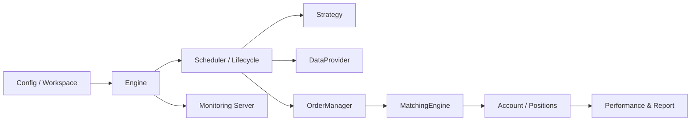
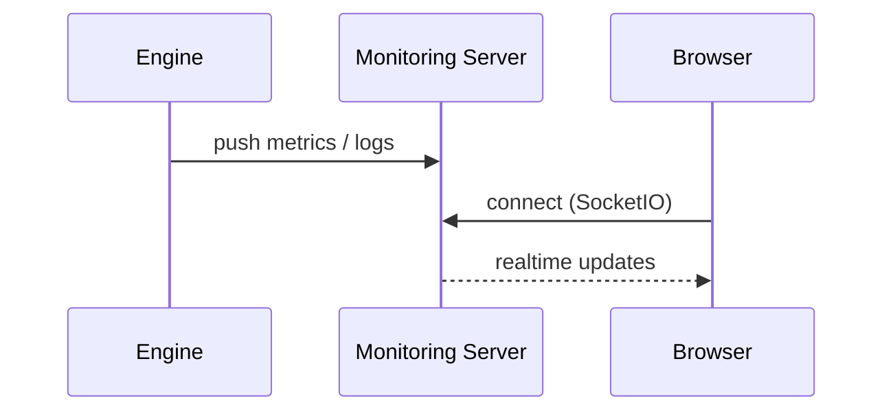

# pqtrader（QTrader）

> 一个**事件驱动（Event-Driven）**的量化回测框架：把“策略”“数据”“撮合/费用”“账户/仓位”“分析/报告”拆开，让你专注在策略本身。

- **定位**：研究/回测用的 Python 框架（不是交易所直连实盘系统）
- **适用人群**：想要快速验证策略、做假设分析（what-if）、沉淀可复用回测基础设施的人

---

## ✨ 核心特性

- **事件驱动引擎**：更贴近真实交易流程（生命周期钩子、调度器、频率控制）
- **策略与框架解耦**：策略只写逻辑，框架负责状态、撮合、统计
- **可插拔数据源**：实现标准接口即可接入 CSV/数据库/在线 API
- **账户与仓位体系**：支持下单、撮合、佣金/滑点、持仓更新等
- **可复现的产物**：工作区（workspace）管理、代码/配置快照、状态持久化（暂停/恢复/分叉）
- **分析与可视化**：性能指标计算、内置监控服务（Flask + SocketIO）

---

## 🧭 项目结构（快速理解）

```text
pqtrader/
├─ qtrader/                 # 核心 Python 包
│  ├─ core/                 # 引擎、上下文、调度、生命周期、工作区
│  ├─ data/                 # 数据接口与示例
│  ├─ trading/              # 账户/仓位/订单/撮合/费用模型
│  ├─ analysis/             # 指标、报告、监控服务
│  ├─ strategy/             # 策略基类
│  └─ tests/                # 单元测试
├─ examples/                # 端到端示例项目（含策略/数据源）
├─ USER_GUIDE.md            # 详细中文用户文档（强烈建议先看）
└─ design/design_v7.md      # 设计笔记
```

---

## 📌 架构示意图（图）

下面这张图说明一次回测的核心流转：



---

## 🚀 快速开始（3 分钟跑起来）

### 1）创建虚拟环境并安装依赖

```bash
python -m venv .venv
source .venv/bin/activate
pip install -r requirements.txt
pip install -e .
```

### 2）运行内置示例

方式 A：以模块方式运行（推荐）

```bash
python -m qtrader.examples.run_backtest
```

方式 B：直接执行脚本

```bash
python qtrader/examples/run_backtest.py
```

运行后会在工作区生成回测产物（日志、快照、报告等）。

---

## 🧩 写一个最小策略（图 + 代码）

策略只需要继承 `qtrader.strategy.base.Strategy`，实现 `initialize/handle_bar` 等钩子。

```python
from qtrader.strategy.base import Strategy

class MyStrategy(Strategy):
    def initialize(self, context):
        context.user_data["symbols"] = ["600519.SH"]

    def handle_bar(self, context):
        # 写你的买卖逻辑
        pass
```

想看更完整的配置与数据接入范式：直接打开 `USER_GUIDE.md`。

---

## 🖥️ 内置监控（图）

框架提供监控服务（Flask + SocketIO），用于在回测期间查看运行状态/指标（具体行为以配置为准）：



---

## 📚 文档

- **中文用户文档**：`USER_GUIDE.md`
- **设计笔记**：`design/design_v7.md`

---

## 🧪 开发与测试

```bash
pip install -e ".[test]"
pytest -q
```

---

## ✅ Roadmap（你可以用它当项目卖点）

- [ ] 更完整的示例数据集与可复现实验
- [ ] 报告模板（多策略对比/多因子评估）
- [ ] 更细粒度的撮合与成交回报建模
- [ ] 更完善的实盘/模拟盘桥接（如果你需要）

---

## ⚠️ License

当前仓库**没有**包含 `LICENSE` 文件。

如果你要把仓库改为公开（Public），我建议你选择一个开源协议（MIT / Apache-2.0 / GPL 等）并加入 `LICENSE`，避免他人无法合法使用/分发。

---

### 你昨天写的“项目介绍”

我目前在仓库里没看到你昨天那段介绍文本（可能在聊天记录或别的文档里）。你把那段文字粘贴给我后，我可以把它融入到 README 顶部（愿景/动机/亮点/对比）让它更“有吸引力”。
