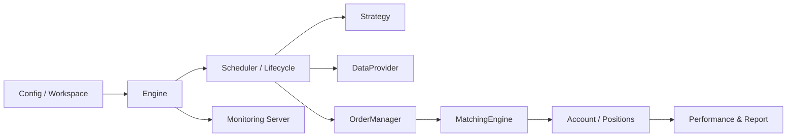
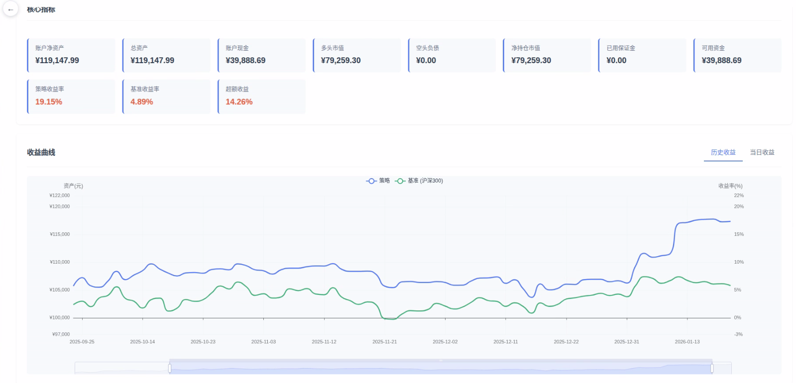
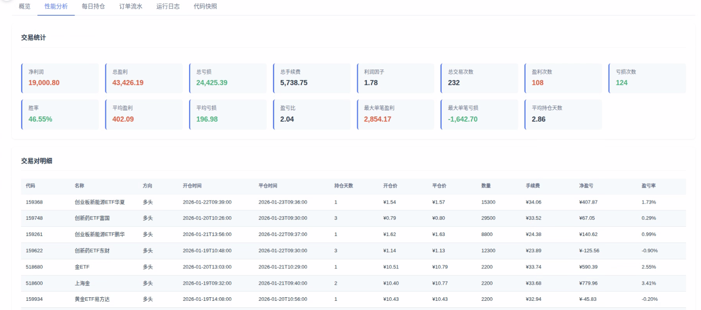
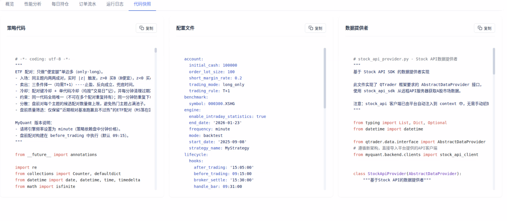
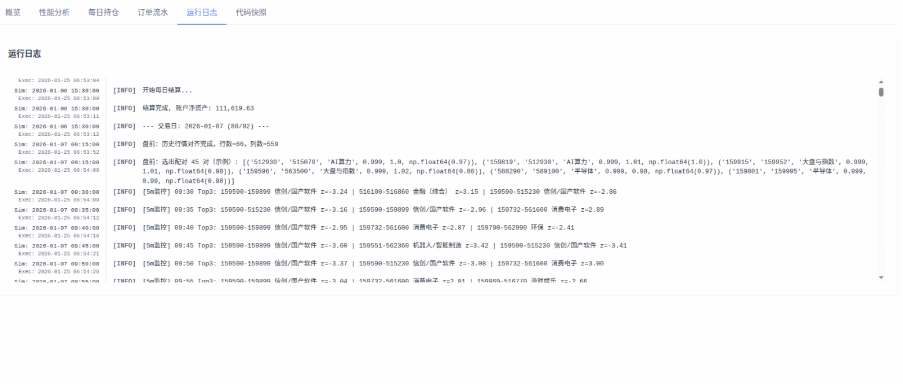

# QTrader📈

<p align="center">
  <b>轻量化 · 事件驱动 · 数据解耦</b><br/>
  一个专注于策略研究与执行闭环的量化回测 / 模拟交易框架
</p>

---

## 为什么是 QTrader？🤔

很多现有的量化回测/模拟系统要么过度“重量化”，要么把核心能力绑定到某个数据平台/收费数据服务（甚至“挂羊头卖狗肉”）。

QTrader 的目标是反过来：

- ✅ **框架只负责**：事件驱动回测/模拟、撮合、账户/持仓、绩效分析、报告与可视化
- 🔌 **数据完全外置**：通过 **Data Contract（数据合约/接口）**获取回测所需的最小数据集
- 🧱 **按需伸缩**：你可以替换数据源实现（CSV / 数据库 / 在线 API / 自建服务），不用改框架核心

> 适合：想要一个“干净、可控、可扩展”的研究框架；不想把策略研究绑死在某个平台或庞大系统里的开发者。

---

## 特性一览 ✨

- ⚙️ **事件驱动架构**：贴近真实交易流程（按日 / 分钟 / Tick 事件循环）
- 🧠 **策略与框架分离**：策略只写交易逻辑，底层撮合/记账由框架完成
- 💾 **状态持久化**（可暂停/恢复/分叉）：支持回测过程保存状态并继续
- 🔌 **数据接入可插拔**：标准接口接入任意数据源
- 📊 **结果分析与报告**：净值曲线、交易记录、关键指标（夏普、回撤等）
- 🖥️ **内置监控/可视化**：便于观察回测过程与结果

---

## 项目结构 🧭

```text
.
├── src/              # 框架源码
├── examples/         # 简要示例（虚拟数据源）
├── tests/            # 测试
├── screenshot/       # README 截图
├── pyproject.toml
└── USER_GUIDE.md     # 用户文档
```

---

## 架构示意图 🗺️



---

## 回测结果截图🖼️






---

## 快速开始 🚀

### 1) 环境

- Python >= 3.9

建议使用虚拟环境（venv/conda 均可）。

### 2) 安装

```bash
python -m pip install -U pip
python -m pip install -e .
```

> 注意：某些系统的 `python` 可能是 `python3`。

### 3) 跑一个最小回测（可复制粘贴）✅

本仓库已经提供了一个端到端示例：

- 策略：`examples/simple_ma/strategy.py`
- 数据源（Mock）：`examples/simple_ma/data_provider.py`
- 配置：`examples/simple_ma/config_backtest.yaml`
- 入口：`examples/simple_ma/run.py`

直接运行：

```bash
cd examples/simple_ma
python run.py
```

说明：

- `run.py` 里包含多种模式（全新回测 / 模拟盘 / 恢复 / 分叉），你可以按注释切换。
- 默认会启用 Web 监控服务（见配置 `server.port`），跑起来后浏览器能看到过程与指标。

---

## 1 分钟理解配置（YAML）⚙️

配置文件是“总开关”，常用项如下（完整示例见 `examples/simple_ma/config_backtest.yaml`）：

```yaml
engine:
  mode: backtest
  frequency: minute
  start_date: "2023-01-01"
  end_date: "2023-10-31"

account:
  initial_cash: 1000000
  trading_rule: "T+1"

matching:
  slippage:
    type: fixed
    rate: 0.001
  commission:
    buy_commission: 0.0002
    sell_commission: 0.0002

server:
  enable: true
  port: 8050
```

---

## 数据合约（Data Contract）怎么实现？🔌

QTrader 的数据解耦核心是一个接口：`src/qtrader/data/interface.py`。

你只要实现这 3 个方法，就能把任意数据源接进来：

- `get_trading_calendar(start, end)`：交易日历
- `get_current_price(symbol, dt)`：某时刻价格快照
- `get_symbol_info(symbol, date)`：标的静态信息（如停牌/名称）

示例（Mock 数据源，仓库已提供）：`examples/simple_ma/data_provider.py`

```python
from qtrader.data.interface import AbstractDataProvider

class MyDataProvider(AbstractDataProvider):
    def get_trading_calendar(self, start: str, end: str) -> list[str]:
        ...

    def get_current_price(self, symbol: str, dt):
        return {"current_price": 10.0}

    def get_symbol_info(self, symbol: str, date: str):
        return {"symbol_name": symbol, "is_suspended": False}
```

---

## 数据合约（Data Contract）理念 🧩

QTrader 不内置任何“数据平台绑定”。框架只依赖一个抽象的数据提供者接口（Data Provider）。运行时通过该接口拉取：

- 📅 交易日历
- 💰 当前/历史价格（按频率）
- 🏷️ 标的基础信息（停牌、名称等）

你可以实现自己的 `DataProvider`：CSV / 本地数据库 / 在线 API / 自建行情因子服务都可以。

---

## 文档 📚

- ✅ 完整用户文档：`USER_GUIDE.md`
- 🧠 设计笔记：`design/design_v7.md`

---

## License 📄

MIT License（见 `LICENSE`）。
